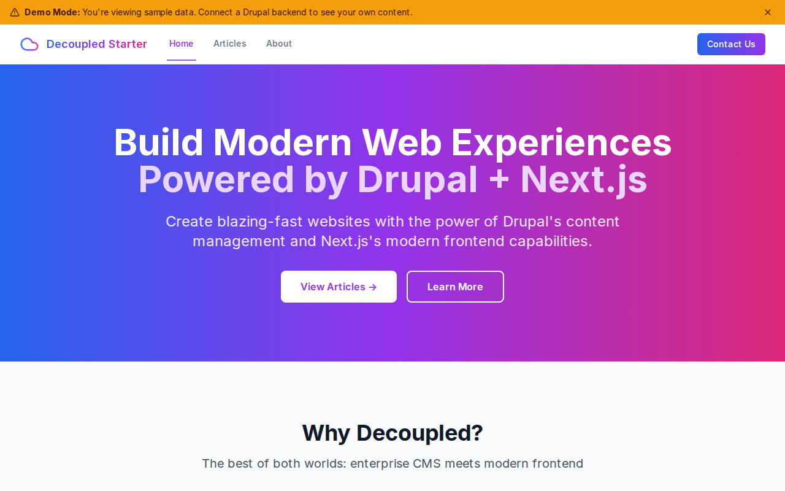

# Decoupled Drupal App

A Next.js application integrated with Decoupled Drupal, built with modern web technologies.



[](https://vercel.com/new/clone?repository-url=https://github.com/nextagencyio/decoupled-starter&project-name=my-app)

## Features

- ⚡ Next.js 15 with App Router
- 🍃 Drupal integration ready
- 🎨 Tailwind CSS for styling
- 📱 Responsive design
- 🔧 TypeScript support
- 🧹 ESLint configuration

## Getting Started

### Quick Start

Create a new project from this template:

```bash
npx degit nextagencyio/decoupled-starter my-app
cd my-app
npm install
```

### Setup with CLI

#### 1. Authenticate with Decoupled.io

```bash
npx decoupled-cli auth login
```

This opens a browser to authenticate with your Decoupled.io account.

#### 2. Create a Drupal space

```bash
npx decoupled-cli spaces create "My App"
```

Note the space ID returned (e.g., `Space ID: 1234`). Wait ~90 seconds for provisioning.

#### 3. Configure environment

Fetch OAuth credentials and save to `.env.local`:

```bash
npx decoupled-cli spaces env 1234 --write .env.local
```

#### 4. Import content (optional)

If you have a content JSON file:

```bash
npx decoupled-cli content import --file data/content.json
```

#### 5. Start development

```bash
npm run dev
```

Open [http://localhost:3000](http://localhost:3000) with your browser to see the result.

## Available Scripts

- `npm run dev` - Start the development server
- `npm run build` - Build the application for production
- `npm run start` - Start the production server
- `npm run lint` - Run ESLint
- `npm run generate-schema` - Generate GraphQL schema from Drupal backend

## GraphQL Schema Generation

After importing content types to Drupal, you must regenerate the GraphQL schema to ensure your frontend has access to the new types:

```bash
npm run generate-schema
```

This script (`scripts/generate-schema.ts`):
1. Authenticates with Drupal using OAuth credentials
2. Performs GraphQL introspection to fetch the current schema
3. Generates `schema/schema.graphql` (SDL format)
4. Generates `schema/introspection.json` (raw introspection result)
5. Generates `schema/types.ts` (TypeScript types)

**Requirements:**
- `NEXT_PUBLIC_DRUPAL_BASE_URL` - Your Drupal site URL
- `DRUPAL_CLIENT_ID` - OAuth client ID
- `DRUPAL_CLIENT_SECRET` - OAuth client secret

> **Note:** OAuth credentials can be obtained via the MCP tool `get_oauth_credentials({ spaceId: YOUR_SPACE_ID })` or from the Drupal admin panel.

## Environment Setup

Copy the example environment file and configure your variables:

```bash
cp .env.example .env.local
```

## MCP Integration

This template is designed to work seamlessly with AI assistants (Claude Code, Cursor) via the Model Context Protocol (MCP). Configure your MCP server to enable:

- **Space Management** - Create, clone, and manage Drupal spaces
- **Content Import** - Import content types and data directly
- **OAuth Credentials** - Retrieve environment variables automatically

See [MCP Documentation](https://docs.decoupled.io/mcp) for setup instructions.

## About

Created by [Next Agency](https://github.com/nextagencyio) for rapid Drupal headless development.

## License

MIT
